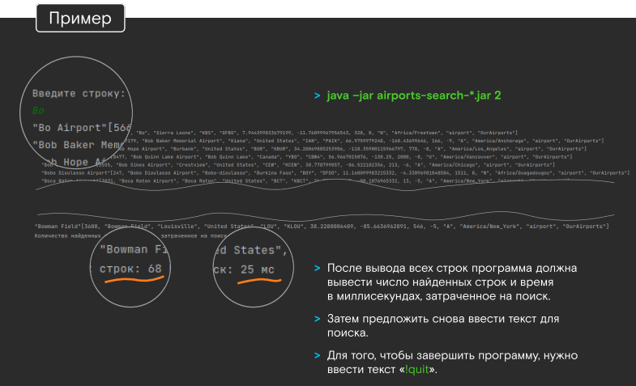

> # <font color="#24a4ff">Библиотека autocomplete вводимого текста</font>

> ## <font color="#0082e6">Постановка задачи.</font>
Требуется написать консольное Java-приложение <font color="green">(JDK 11)</font>, позволяющее быстро искать данные аэропортов по вводимому пользователем тексту.

Данные для программы берутся из файла. В нем находится таблица аэропортов со свойствами в формате <font color="green">CSV</font>. За что отвечает каждая колонка – не важно.

Сборка проекта осуществляется с помощью Maven. После сборки исходного кода командой <font color="green">mvn clean package</font>,
получаем <font color="green">airports-search-*.jar</font> в качестве артефакта для запуска.

Пользователь запускает приложение, указывая параметром номер колонки (нумерация
начинается с 1, а не с 0) по которой требуется поиск:

```
java –jar airports-search-*.jar 2  // запуск приложения в режиме поиска по второй колонке
```
После запуска программа выводит в консоль предложение ввести текст. Например,
пользователь вводит «Bo» и нажимает «Enter». Программа выводит список всех строк из
файла airports.dat, вторая колонка которых начинается на «Bo», отсортированных по этой
колонке в формате «<font color="#ff9900"><Найденное значение нужной колонки> [<Полностью строка>]</font>».

Для строковых колонок, значения которых заключены в кавычки, должен быть
лексикографический порядок, а для числовых — числовой. Не буквенные и не цифровые
символы также участвуют в поиске. Регистр букв не имеет значения.



> ## <font color="#0082e6">Не функциональные требования:</font>

 - Перечитывать все строки файла при каждом поиске нельзя 
(в том числе читать только определенную колонку у каждой строки).

 - Создавать новые файлы или редактировать текущий нельзя
(в том числе использовать СУБД).

 - Хранить весь файл в памяти нельзя
(не только в качестве массива байт, но и в структуре, которая так или иначе содержит все
данные из файла).

 - Для корректной работы программе требуется не более 7 МБ памяти 

(все запуски java –jar должны выполняться с флагом ).

 - Скорость поиска должна быть максимально высокой с учетом требований выше 

(в качестве ориентира можно взять число из скриншота выше: на поиск по «Bo», который
выдает 68 строк, требуется 25 мс).

 - Сложность поиска меньше чем O(n), где n — число строк файла.

 - Должны соблюдаться принципы ООП и SOLID.

 - Ошибочные и краевые ситуации должны быть корректно обработаны.

 - Использовать готовые библиотеки для парсинга CSV формата нельзя.

 - Решенное тестовое задание — код в публичном репозитории на GitHub.

*<font color="#0082e6">(!)</font> В случае, если возникает вопрос, который не покрывает данная
постановка задачи, кандидат должен сам выбрать любое его решение,
не противоречащее постановке. В readme должно быть отражен
вопрос и принятое решение.*

